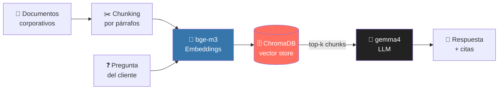

<div align="center">

# 🤖 Asistente Virtual RAG — TechShop

### Sistema de atención al cliente con RAG, ejecutándose **100% en local**

[](https://www.python.org/)
[](https://ollama.com/)
[](https://www.trychroma.com/)
[]()
[]()

</div>

---

Asistente conversacional basado en **Generación Aumentada por Recuperación (RAG)** que responde dudas de clientes de la tienda online **TechShop** sobre envíos, devoluciones, garantías y métodos de pago.

Todo —base de conocimiento, vectores e inferencia del LLM— corre **en tu propia máquina**. Sin datos saliendo a terceros, sin latencias de red y sin coste de APIs.

## ✨ Características

| | |
|---|---|
| 🔒 **100% local** | Embeddings y LLM corren con [Ollama](https://ollama.com/), sin salir de tu equipo |
| 🧩 **Chunking por párrafos** | Segmenta respetando los `\n\n`, sin partir frases ni ideas a la mitad |
| 🎯 **Anti-alucinaciones** | *System prompt* estricto: el LLM solo responde con el contexto recuperado, o admite que no lo sabe |
| ⚡ **ChromaDB en memoria** | Indexación y recuperación por similitud, rápida y sin persistencia en disco |
| 📑 **Respuestas con cita** | Cada respuesta indica la política oficial en la que se basa |

## 🛠️ Arquitectura del pipeline



## 🧠 Modelos (vía Ollama)

| Rol | Modelo | Para qué |
|-----|--------|----------|
| Embeddings | `bge-m3:latest` | Vectoriza chunks y preguntas (multilingüe, bueno en español) |
| Generación | `gemma4:latest` | Redacta la respuesta final a partir del contexto |

## 📦 Instalación

**1. Instala Ollama** desde [ollama.com](https://ollama.com) y arranca el servicio en segundo plano.

**2. Descarga los modelos:**

```bash
ollama pull bge-m3:latest    # embeddings multilingües
ollama pull gemma4:latest    # LLM de generación
```

**3. Clona el repo e instala dependencias:**

```bash
git clone https://github.com/TU_USUARIO/asistente-rag-local.git
cd asistente-rag-local
pip install chromadb ollama numpy
```

> [!NOTE]
> Asegúrate de tener el servicio de Ollama **activo** antes de ejecutar el notebook.

## ▶️ Uso

Abre `asistente_techshop_rag.ipynb` y ejecuta las celdas en orden. La última lanza un chat interactivo en consola:

```
💬 Chat con el asistente virtual de TechShop
Tú: ¿Cuánto cuesta el envío express?
🤖 Asistente: El envío express cuesta 4,99€ y tarda 1-2 días hábiles. (Fuente: Política de Envíos)
```

Escribe `salir` para terminar.

## ⚙️ Configuración

Constantes ajustables en la celda de configuración:

| Parámetro | Valor | Descripción |
|-----------|-------|-------------|
| `CHUNK_SIZE` | `600` | Tamaño objetivo de cada chunk (caracteres) |
| `N_CHUNKS_RECUPERADOS` | `5` | Nº de chunks que se pasan al LLM como contexto |
| `MODELO_EMBEDDING` | `bge-m3:latest` | Modelo de embeddings |
| `MODELO_LLM` | `gemma4:latest` | Modelo de lenguaje |

## 📁 Estructura del notebook

1. **Imports y verificación** — `chromadb`, `ollama`, `numpy`
2. **Configuración** — constantes del sistema
3. **Base de conocimiento** — 4 políticas de TechShop (envíos, devoluciones, garantías, pagos)
4. **Chunking semántico** — `dividir_en_chunks_por_parrafos()`
5. **Clase `AsistenteTechShop`** — embedder, vector store, indexación, recuperación y generación
6. **Inicialización e indexado**
7. **Batería de pruebas** — incluye un control fuera de dominio para verificar que no alucina
8. **Chat interactivo**

---

<div align="center">
<sub>Proyecto de demostración de una arquitectura RAG local y privada.</sub>
</div>
